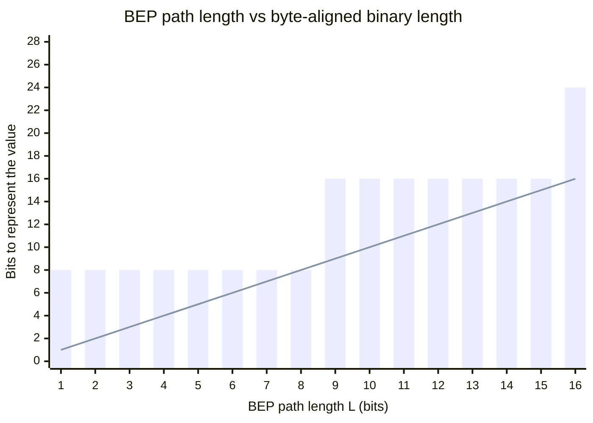

# Binary Equation Paths

**Author:** Rich Wagner  
**Date:** March 11, 2026  
**Revision:** May 8, 2026
**Contact:** rich@newdawndata.com

\---

## Abstract

Traditional computing has utilized the base-256 model for binary management since IBM moved to an 8-bit system on April 7th, 1964. Binary itself was created after mathematician Gottfried Leibniz corresponded with Jesuit missionary Joachim Bouvet regarding mathematics, and received the 64 Hexagrams showing solid and broken lines (0's and 1's in Leibniz's mind). These hexagrams were reorganized by Shao Yong in the 11th century from the I Ching divination manual and philosophical framework.

Binary was meant to be a universal correspondence tool for all information. By assuming binary randomness, an equation for a shorter binary path can be found for all available numbers not equating to 0 or 1, achieved by transforming the Collatz Conjecture into a path-based solution. Two complementary walks emerge from this construction — a **floor walk** that strips the least significant bit at each step and a **ceil walk** that rounds upward — and both converge to 1 with provably optimal step counts of `⌊log₂(n)⌋` and `⌈log₂(n)⌉` respectively.

The orange bars are byte-aligned binary length; the purple line is the BEP path length. The vertical gap between the top of each bar and the line is the per-integer bit saving — biggest right after each byte boundary
(L = 1, L = 8), smallest right before one (L = 7, L = 15).



\---

## Table of Contents

1. [Introduction](#1-introduction)
2. [Proof of Convergence](#2-proof-of-convergence)

   * [Definitions](#definitions)
   * [Floor Walk Convergence](#floor-walk-convergence)

     * [Lemma F1 — Closure on Positive Integers](#lemma-f1--closure-on-positive-integers)
     * [Lemma F2 — Strict Decrease](#lemma-f2--strict-decrease)
     * [Lemma F3 — Unique Fixed Point](#lemma-f3--1-is-the-unique-fixed-point)
     * [Theorem F — Convergence to 1](#theorem-f--convergence-to-1)
     * [Step Count Bound — Floor Walk](#step-count-bound--floor-walk)
   * [Ceil Walk Convergence](#ceil-walk-convergence)

     * [Lemma C1 — Closure on Positive Integers](#lemma-c1--closure-on-positive-integers)
     * [Lemma C2 — Strict Decrease](#lemma-c2--strict-decrease)
     * [Lemma C3 — Unique Fixed Point](#lemma-c3--1-is-the-unique-fixed-point)
     * [Theorem C — Convergence to 1](#theorem-c--convergence-to-1)
     * [Step Count Bound — Ceil Walk](#step-count-bound--ceil-walk)
   * [Comparison of the Two Walks](#comparison-of-the-two-walks)
   * [Contrast with Original Collatz](#contrast-with-the-original-collatz-conjecture)
3. [Compression](#3-compression)

   * [Floor Walk — Worked Example](#floor-walk--worked-example)
   * [Ceil Walk — Worked Example](#ceil-walk--worked-example)
   * [Samples](#samples)
   * [Numeric Observations](#numeric-observations-in-current-byte-structures)
   * [Compression Functions](#compression-functions)
   * [Decompression Functions](#decompression-functions)
4. [Endianness](#4-endianness)

   * [What is Byte Order?](#what-is-byte-order)
   * [How BEP Handles Endianness](#how-bep-handles-endianness)
   * [FlipByteOrder Helper](#flipbyteorder-helper)
   * [Unified API](#unified-api)
   * [Big Endian Examples](#big-endian-examples)
   * [Little Endian Examples](#little-endian-examples)
   * [Value Compression — Endian-Agnostic](#value-compression--endian-agnostic)

\---

## 1\. Introduction

Binary is a base-2 numbering system where each digit (bit) can only be `0` or `1`. Converting to base-256 means grouping those bits into chunks of 8 (since 2⁸ = 256), where each chunk forms a single "digit" in the base-256 system with a value ranging from 0 to 255. This example is written in Big-Endian methodology for readability.

**Formula:**

```
Total = y + (x \* z)
```

|Number (z)|1|2|4|8|16|32|64|128|
|-|-|-|-|-|-|-|-|-|
|Bit (x)|0|1|0|1|1|0|1|1|
|**Total (y)**|**0**|**2**|**2**|**10**|**26**|**26**|**90**|**218**|

For example, the binary number `11001010 00110001` consists of two 8-bit groups: `11001010` (202 in decimal) and `00110001` (49 in decimal), making it the two-digit base-256 number `\[202, 49]`. This is exactly how computers represent raw bytes — every byte is one base-256 digit — which is why base-256 is so natural in computing:

* A 32-bit integer is a 4-digit base-256 number
* An IPv4 address is a 4-digit base-256 number written with dots (e.g., `192.168.1.1`)
* Encoding schemes like Base64 exist to compress or transport these base-256 byte sequences in text-safe formats

The positional value of each digit follows the same rule as any base system: the rightmost digit is multiplied by 256⁰, the next by 256¹, then 256², and so on:

```
\[202, 49] = (202 × 256¹) + (49 × 256⁰) = 51,762 in decimal
```

By taking this decimal as an integer and applying an alteration on the Collatz Conjecture formula, a shorter path can be found, resulting in a smaller binary string.

### The Collatz Conjecture

The Collatz Conjecture is a simple but unsolved problem in mathematics that studies what happens when you repeatedly apply a rule to any positive integer:

* If the number is **even**, divide it by 2
* If the number is **odd**, multiply it by 3 and add 1
* Repeat with the new number

**Standard Collatz Function:**

```
a(k+1) = a(k) / 2         if a(k) is even
a(k+1) = 3 \* a(k) + 1    if a(k) is odd
```

For example, starting with 13:

```
13 → 40 → 20 → 10 → 5 → 16 → 8 → 4 → 2 → 1
```

The conjecture states that no matter what positive integer you start with, the sequence will eventually reach 1. Despite being extremely simple, this has never been formally proven for all numbers.

### Binary Equation Path Functions

By altering the odd-based equation to **adjust by one** rather than multiply by three and add one, the unsolved issue with the Collatz Conjecture is removed. Two complementary adjustments exist — subtracting one before halving (the **floor walk**) or adding one before halving (the **ceil walk**). Both produce strictly decreasing sequences that converge to 1, and each has a closed-form step count.

**Floor Walk — Binary Equation Path Formula (subtracts on odd):**

```
f(n) = n / 2          if n is even   → add primary bit
f(n) = (n - 1) / 2    if n is odd    → swap and add primary bit
```

This is equivalent to `f(n) = ⌊n/2⌋` — an integer right-shift that strips the least significant bit at each step.

**Ceil Walk — Binary Equation Path Formula (adds on odd):**

```
g(n) = n / 2          if n is even   → add primary bit
g(n) = (n + 1) / 2    if n is odd    → swap and add primary bit
```

This is equivalent to `g(n) = ⌈n/2⌉` — the upward-rounded counterpart of `f`.

Both methodologies take the binary numeric representation of any number and convert the compressed binary string into an equation. The floor walk reaches 1 in exactly `⌊log₂(n)⌋` steps; the ceil walk reaches 1 in exactly `⌈log₂(n)⌉` steps.

\---

## 2\. Proof of Convergence

### Definitions

Define the two **Binary Equation Path functions** `f, g : Z+ → Z+`:

```
                  ⎧ n / 2          if n is even
f(n)  =  ⌊n/2⌋  = ⎨
                  ⎩ (n - 1) / 2    if n is odd

                  ⎧ n / 2          if n is even
g(n)  =  ⌈n/2⌉  = ⎨
                  ⎩ (n + 1) / 2    if n is odd
```

For a positive integer `n₀`, define the two sequences:

```
n₀, n₁ = f(n₀), n₂ = f(n₁), ..., n(k+1) = f(nk)        (floor walk)
m₀, m₁ = g(m₀), m₂ = g(m₁), ..., m(k+1) = g(mk)        (ceil walk)
```

**Claim (Floor):** For all positive integers `n₀ ≥ 2`, there exists a finite `K\_f` such that `n\_{K\_f} = 1`, and the smallest such `K\_f` equals `⌊log₂(n₀)⌋`.

**Claim (Ceil):** For all positive integers `m₀ ≥ 2`, there exists a finite `K\_g` such that `m\_{K\_g} = 1`, and the smallest such `K\_g` equals `⌈log₂(m₀)⌉`.

\---

## Floor Walk Convergence

### Lemma F1 — Closure on Positive Integers

For all `n ≥ 2`, `f(n) ≥ 1`.

**Proof:**

* *Even case:* `f(n) = n/2`. Since `n ≥ 2`, `f(n) ≥ 1`. ✓
* *Odd case:* `f(n) = (n-1)/2`. Since `n ≥ 3` (smallest odd integer > 1), `f(n) = (n-1)/2 ≥ 1`. ✓

Therefore `f(n)` remains a positive integer for all `n ≥ 2`. ∎

\---

### Lemma F2 — Strict Decrease

For all `n ≥ 2`, `f(n) < n`.

**Proof:**

* *Even case:* `n/2 < n` for all `n ≥ 1`. ✓
* *Odd case:* We need `(n-1)/2 < n`, i.e. `n - 1 < 2n`, i.e. `-1 < n`. This holds for all `n ≥ 1`. ✓

Therefore `f` strictly decreases `n` at every step. ∎

\---

### Lemma F3 — 1 is the Unique Fixed Point

There is no `n ∈ Z+` such that `f(n) = n`.

**Proof:**

* *Even case:* `n/2 = n` implies `n = 0`. Not a positive integer. ✗
* *Odd case:* `(n-1)/2 = n` implies `n = -1`. Not a positive integer. ✗

Therefore the sequence has no cycles — it strictly decreases without getting stuck. ∎

\---

### Theorem F — Convergence to 1

**For all positive integers `n₀ ≥ 2`, the sequence `{nk}` reaches `1` in finitely many steps.**

**Proof:**

By **Lemma F1**, each `nk ≥ 1` — the sequence stays in the positive integers.

By **Lemma F2**, `n(k+1) < nk` for all `nk ≥ 2` — the sequence is strictly decreasing.

By the **Well-Ordering Principle** (every non-empty subset of the positive integers has a minimum element), a strictly decreasing sequence of positive integers cannot be infinite — it must terminate.

The sequence terminates when `nk = 1`, since `f(1) = 0` exits the positive integers, and by **Lemma F3** the sequence cannot cycle before reaching 1.

Therefore, there exists a finite `K\_f` such that `n\_{K\_f} = 1`. ∎

\---

### Step Count Bound — Floor Walk

**The floor sequence reaches 1 in exactly `⌊log₂(n₀)⌋` steps.**

**Proof:**

In both cases, `f(n) = ⌊n/2⌋`:

* Even: `n/2 = ⌊n/2⌋` ✓
* Odd: `(n-1)/2 = ⌊n/2⌋` ✓

Therefore `f` is exactly the **integer right-shift** — each application removes the least significant bit of `n`.

By induction on `k`, `f^k(n₀) = ⌊n₀ / 2^k⌋`. Setting `f^{K\_f}(n₀) = 1` gives `⌊n₀ / 2^{K\_f}⌋ = 1`, which holds iff `2^{K\_f} ≤ n₀ < 2^{K\_f+1}`, i.e. `K\_f = ⌊log₂(n₀)⌋`. ∎

> \*\*Key insight:\*\* The bit-flip behavior recorded at each step (the primary bit `a`) is the compression output. The underlying walk is simply stripping bits off the number one at a time — equivalent to reading the binary representation of `n` from most-significant to least-significant bit.

\---

## Ceil Walk Convergence

### Lemma C1 — Closure on Positive Integers

For all `n ≥ 2`, `g(n) ≥ 1`.

**Proof:**

* *Even case:* `g(n) = n/2`. Since `n ≥ 2`, `g(n) ≥ 1`. ✓
* *Odd case:* `g(n) = (n+1)/2`. Since `n ≥ 3` (smallest odd integer > 1), `g(n) = (n+1)/2 ≥ 2 ≥ 1`. ✓

Therefore `g(n)` remains a positive integer for all `n ≥ 2`. ∎

\---

### Lemma C2 — Strict Decrease

For all `n ≥ 2`, `g(n) < n`.

**Proof:**

* *Even case:* `n/2 < n` for all `n ≥ 1`. ✓
* *Odd case:* We need `(n+1)/2 < n`, i.e. `n + 1 < 2n`, i.e. `1 < n`. This holds for all `n ≥ 2`, and the smallest odd integer satisfying `n ≥ 2` is `n = 3`, where `g(3) = 2 < 3`. ✓

Therefore `g` strictly decreases `n` at every step for `n ≥ 2`. ∎

\---

### Lemma C3 — 1 is the Unique Fixed Point

The only `n ∈ Z+` such that `g(n) = n` is `n = 1`.

**Proof:**

* *Even case:* `n/2 = n` implies `n = 0`. Not a positive integer. ✗
* *Odd case:* `(n+1)/2 = n` implies `n + 1 = 2n`, i.e. `n = 1`. ✓

Therefore the only fixed point in `Z+` is `n = 1`, which serves as the termination state. For all `n ≥ 2` the sequence has no cycles — it strictly decreases until it reaches 1. ∎

\---

### Theorem C — Convergence to 1

**For all positive integers `m₀ ≥ 2`, the sequence `{mk}` reaches `1` in finitely many steps.**

**Proof:**

By **Lemma C1**, each `mk ≥ 1` — the sequence stays in the positive integers.

By **Lemma C2**, `m(k+1) < mk` for all `mk ≥ 2` — the sequence is strictly decreasing while above 1.

By the **Well-Ordering Principle**, a strictly decreasing sequence of positive integers must terminate. By **Lemma C3** the only terminal value reachable from `m₀ ≥ 2` is `m\_k = 1`, since 1 is the unique fixed point.

Therefore, there exists a finite `K\_g` such that `m\_{K\_g} = 1`. ∎

\---

### Step Count Bound — Ceil Walk

**The ceil sequence reaches 1 in exactly `⌈log₂(m₀)⌉` steps.**

**Proof:**

In both cases, `g(n) = ⌈n/2⌉`:

* Even: `n/2 = ⌈n/2⌉` ✓
* Odd: `(n+1)/2 = ⌈n/2⌉` ✓

We claim `g^k(m₀) = ⌈m₀ / 2^k⌉` for all `k ≥ 0`.

* *Base case (k = 0):* `g^0(m₀) = m₀ = ⌈m₀ / 2^0⌉`. ✓
* *Inductive step:* Assume `g^k(m₀) = ⌈m₀ / 2^k⌉`. Then  
`g^{k+1}(m₀) = g(g^k(m₀)) = g(⌈m₀/2^k⌉) = ⌈⌈m₀/2^k⌉ / 2⌉ = ⌈m₀ / 2^{k+1}⌉`,  
using the standard integer-arithmetic identity `⌈⌈x⌉/m⌉ = ⌈x/m⌉` for any positive integer `m`. ✓

Setting `g^{K\_g}(m₀) = 1` gives `⌈m₀ / 2^{K\_g}⌉ = 1`, which holds iff `0 < m₀ / 2^{K\_g} ≤ 1`, i.e. `2^{K\_g} ≥ m₀`, i.e. `K\_g ≥ log₂(m₀)`. Since `K\_g` is a non-negative integer, the smallest such `K\_g` is `⌈log₂(m₀)⌉`. ∎

> \*\*Key insight:\*\* Where `f` strips the least significant bit, `g` rounds away from zero on every odd step. For powers of 2 (`m₀ = 2^k`) the two walks are identical and both take `k` steps. For all other `m₀`, the ceil walk takes exactly one more step than the floor walk — the extra step accounting for the rounding-up behavior on the first odd value encountered.

\---

## Comparison of the Two Walks

|Property|Floor Walk `f(n) = ⌊n/2⌋`|Ceil Walk `g(n) = ⌈n/2⌉`|
|-|-|-|
|Even rule|`n/2`|`n/2`|
|Odd rule|`(n-1)/2`|`(n+1)/2`|
|Convergence proven?|✅ Theorem F|✅ Theorem C|
|Strictly decreasing on `n ≥ 2`?|✅ Lemma F2|✅ Lemma C2|
|Fixed points|None in `Z+`|Only `n = 1` (the terminus)|
|Closed-form step count|`⌊log₂(n)⌋`|`⌈log₂(n)⌉`|
|Iterated form|`f^k(n) = ⌊n / 2^k⌋`|`g^k(n) = ⌈n / 2^k⌉`|
|Bit interpretation|Right-shift (drop LSB)|Round-up halving|

For powers of 2, `⌊log₂(n)⌋ = ⌈log₂(n)⌉`, so the two walks have identical step counts. For all other positive integers ≥ 2, the ceil walk is exactly one step longer than the floor walk.

\---

## Contrast with the Original Collatz Conjecture

|Property|Original Collatz (`3n + 1`)|Floor Walk (`n - 1`)|Ceil Walk (`n + 1`)|
|-|-|-|-|
|Convergence proven?|❌ Unsolved|✅ Proven|✅ Proven|
|Monotone decreasing?|❌ Odd step increases `n`|✅ Always decreases|✅ Always decreases|
|Fixed points / cycles?|Unknown in general|✅ None|✅ Only `n = 1`|
|Step bound|Unknown|✅ Exactly `⌊log₂ n⌋`|✅ Exactly `⌈log₂ n⌉`|
|Bit interpretation|Not direct|✅ Right-shift|✅ Round-up halving|

The original Collatz function's odd rule `3n + 1` can dramatically **increase** `n`, which is precisely why convergence is so difficult to prove. Replacing it with `n - 1` (floor walk) or `n + 1` (ceil walk) makes the odd step a decrease in both cases, and the entire convergence proof reduces to the Well-Ordering Principle — one of the most fundamental properties of the integers. The two adjustments give two distinct paths to 1 with mirror-image step bounds.

\---

## 3\. Compression

### Floor Walk — Worked Example

Given the following binary code:

```
10011101 01000110 00001100 01011101
```

Converted into traditional bytes:

|Number (z)|1|256|65536|16777216|
|-|-|-|-|-|
|Bit (x)|185|98|48|186|
|**Total (y)**|**185**|**25273**|**3171001**|**3123733177**|

Then, running the total through the floor walk — if the number is **odd**, start the binary with `"1"`; if **even**, `"0"` (this is the **primary bit**, `a`):

|Step|Bit|Value|Note|
|-|-|-|-|
|—|—|**3123733177**|a = 1|
|1|1|**3123733176**||
|2|1|**1561866588**||
|3|1|**780933294**||
|4|1|**390466647**|a = 0|
|—|—|**390466646**||
|5|0|**195233323**|a = 1|
|—|—|**195233322**||
|6|1|**97616661**|a = 0|
|—|—|**97616660**||
|7|0|**48808330**||
|8|0|**24404165**|a = 1|
|—|—|**24404164**||
|9|1|**12202082**||
|10|1|**6101041**|a = 0|
|—|—|**6101040**||
|11|0|**3050520**||
|12|0|**1525260**||
|13|0|**762630**||
|14|0|**381315**|a = 1|
|—|—|**381314**||
|15|1|**190657**|a = 0|
|—|—|**190656**||
|16|0|**95328**||
|17|0|**47664**||
|18|0|**23832**||
|19|0|**11916**||
|20|0|**5958**||
|21|—|**2979**|a = 1|
|—|—|**2978**||
|22|1|**1489**|a = 0|
|—|—|**1488**||
|23|0|**744**||
|24|0|**372**||
|25|0|**186**||
|26|0|**93**|a = 1|
|—|—|**92**||
|27|1|**46**||
|28|1|**23**|a = 0|
|—|—|**22**||
|29|0|**11**|a = 1|
|—|—|**10**||
|30|1|**5**|a = 0|
|—|—|**4**||
|31|0|**2**||
|—|—|**1**||

This method reduces the original binary:

```
10011101 01000110 00001100 01011101   (32 bits)
```

To:

```
11110100 11000010 00001000 011010     (30 bits, floor walk)
```

The path length is `⌊log₂(3123733177)⌋ = 31`, matching the 31 recorded steps; trailing zero bits in the original are dropped because they don't contribute to the integer value, and dropped leading bits in the result reflect the floor walk's natural compaction.

### Ceil Walk — Worked Example

Running the same value `3,123,733,177` through the ceil walk — odd values now **add** one before halving — produces a path of length `⌈log₂(3123733177)⌉ = 32`:

```
origin (32):  10011101 01000110 00001100 01011101
ceil   (32):  10011101 01000110 00001100 01011101
```

For this particular value the ceil walk produces a 32-bit path (one bit longer than the floor walk's 30-bit result, since the ceil walk takes 32 steps versus the floor walk's 31), reflecting the universal `⌈log₂(n)⌉` step bound.

> \*\*Note:\*\* The values `0` and `1` are inaccessible by either methodology due to their mathematical binary equation. Every integer from \*\*2 to 255\*\* has a `⌊log₂(n)⌋ ≤ 7`-bit floor path and a `⌈log₂(n)⌉ ≤ 8`-bit ceil path. The two paths coincide in length at powers of 2 and differ by exactly one bit elsewhere. This applies to all numbers with no dictionary, storage methodology, or indexing required.

\---

## Samples

### 32-Bit Samples (Floor Walk)

```
origin (32):  11001011111111011101001111000110
result (30):  011110101110010110101010110001

origin (32):  01000000010001001110001100111100
result (29):  10100010000101110000111111110

origin (32):  10001011010000110011011010111101
result (31):  0010100110110111011111001001111
```

### 26-Bit Samples (Floor Walk)

```
origin (26):  00001000111111010011001110
result (24):  010001000110101011110000

origin (26):  11101100101110000010110100
result (23):  00100111111010011101101

origin (26):  00100100011001101000011101
result (25):  0010111110010001000011100
```

### 20-Bit Samples (Floor Walk)

```
origin (20):  10111101110001010101
result (19):  1100110000101101011

origin (20):  11010101111011000110
result (18):  100001001010011001

origin (20):  11111101000001001110
result (18):  010001111110010101
```

### 14-Bit Samples (Floor Walk)

```
origin (14):  01011101111101
result (13):  1101010010110

origin (14):  11110100101010
result (12):  110011100101

origin (14):  11000100100100
result (11):  00011100001
```

### 8-Bit Samples — Floor vs Ceil Walks

|value|binary|floor path|ceil path|
|-|-|-|-|
|2|00000010|0|0|
|3|00000011|1|11|
|4|00000100|00|00|
|11|00001011|001|0011|
|128|10000000|0000000|0000000|
|129|10000001|1111111|11010101|
|254|11111110|0101010|11111110|
|255|11111111|1010101|11111111|

For all powers of 2, floor and ceil paths coincide. For all other values, the ceil path is exactly one bit longer.

\---

## Numeric Observations in Current Byte Structures

By incorporating the ASCII codes for standardized English (without accents), and performing standardized byte swaps to incorporate the 7-bit range (as standardized by ANSI in 1963), you can reduce used bits into a 7-bit range — fully recalculable, without storage of swaps or designation.

**ASCII Reference Table (32–127):**

|Dec|Binary|Char|Dec|Binary|Char|Dec|Binary|Char|
|-|-|-|-|-|-|-|-|-|
|32|0100000|SP|65|1000001|A|98|1100010|b|
|33|0100001|!|66|1000010|B|99|1100011|c|
|34|0100010|"|67|1000011|C|100|1100100|d|
|35|0100011|#|68|1000100|D|101|1100101|e|
|36|0100100|$|69|1000101|E|102|1100110|f|
|37|0100101|%|70|1000110|F|103|1100111|g|
|38|0100110|\&|71|1000111|G|104|1101000|h|
|39|0100111|'|72|1001000|H|105|1101001|i|
|40|0101000|(|73|1001001|I|106|1101010|j|
|41|0101001|)|74|1001010|J|107|1101011|k|
|42|0101010|\*|75|1001011|K|108|1101100|l|
|43|0101011|+|76|1001100|L|109|1101101|m|
|44|0101100|,|77|1001101|M|110|1101110|n|
|45|0101101|-|78|1001110|N|111|1101111|o|
|46|0101110|.|79|1001111|O|112|1110000|p|
|47|0101111|/|80|1010000|P|113|1110001|q|
|48|0110000|0|81|1010001|Q|114|1110010|r|
|49|0110001|1|82|1010010|R|115|1110011|s|
|50|0110010|2|83|1010011|S|116|1110100|t|
|51|0110011|3|84|1010100|T|117|1110101|u|
|52|0110100|4|85|1010101|U|118|1110110|v|
|53|0110101|5|86|1010110|V|119|1110111|w|
|54|0110110|6|87|1010111|W|120|1111000|x|
|55|0110111|7|88|1011000|X|121|1111001|y|
|56|0111000|8|89|1011001|Y|122|1111010|z|
|57|0111001|9|90|1011010|Z|123|1111011|{|
|58|0111010|:|91|1011011|\[|124|1111100|\||
|59|0111011|;|92|1011100|\\|125|1111101|}|
|60|0111100|<|93|1011101|]|126|1111110|\~|
|61|0111101|=|94|1011110|^|127|1111111|DEL|
|62|0111110|>|95|1011111|\_||||
|63|0111111|?|96|1100000|`||||
|64|1000000|@|97|1100001|a||||

These are operations similar to Huffman coding, DEFLATE, and other compression algorithms. However, with this methodology, compression can continue further by re-initiating either Binary Equation Path formula — the binary can be further compressed while the program retains the designated result value.

\---

## Compression Functions

The baseline implementation exposes a unified entry point that accepts `byteWidth` (1–4) and a `ByteOrder` enum, dispatching to the appropriate internal variant automatically. See [Section 4 — Endianness](#4-endianness) for full examples of both conventions.

### Unified Entry Points (C#)

```csharp
// Compress a binary string (floor walk, default)
string result = BEP.Compress(binary, byteWidth, ByteOrder.BigEndian);
string result = BEP.Compress(binary, byteWidth, ByteOrder.LittleEndian);

// Decompress a BEP path string back to binary
string original = BEP.Decompress(path, byteWidth, ByteOrder.BigEndian);
string original = BEP.Decompress(path, byteWidth, ByteOrder.LittleEndian);

// Ceil-walk variants
string resultC   = BEP.CompressCeil(binary, byteWidth, ByteOrder.BigEndian);
string originalC = BEP.DecompressCeil(path, byteWidth, ByteOrder.BigEndian);
```

### Compressor (C#)

```csharp
static string Compressor4BE(string used)
{
    byte\[] bin = BinToByteArrBE(used);          // Parse binary string MSB-first
    long val   = ByteLongConvert(bin, 256);     // Merge bytes into base-256 integer
    return RunCompression(val, 32);             // Walk to 1, record path
}
```

### Decompressor (C#)

```csharp
static string Decompressor4BE(string bts)
{
    long origVal     = RunDecompression(bts);   // Reverse the walk to recover integer
    byte\[] origBytes = IntByteConvert4(origVal); // Split back into bytes
    return ByteArrToBinBE(origBytes);           // Convert to Big Endian binary string
}
```

> \*\*Key note on trailing zeros:\*\* Trailing `0`s on a binary number are dropped during compression as they don't contribute to the integer value, requiring fewer steps. When decompressing, use `Convert.ToInt32(value, base)` and `Convert.ToString(value, base)` so native functions auto-populate string lengths correctly.

### Value Compressor — Floor Walk (C#)

```csharp
static string ValCompressor(long val)
{
    string chars    = "0";  // Primary bit — flips on every odd step
    string opbinary = "";
    while (val != 1)
    {
        if (val % 2 == 1)
        {
            chars = (chars == "0") ? "1" : "0";
            val  -= 1;
        }
        val /= 2;
        opbinary = chars + opbinary;
    }
    return opbinary;
}
```

### Value Decompressor — Floor Walk (C#)

```csharp
static long ValDecompressor(string bts)
{
    long odd = Convert.ToInt32(char.GetNumericValue(bts[bts.Length - 1]));
    long val = 1;
    char lc  = bts[0];
    foreach (char c in bts)
    {
        if (c != lc) val += 1;
        val \*= 2;
        lc = c;
    }
    long origVal = val;
    if (odd == 1) origVal += 1;
    return origVal;
}
```

### Value Compressor — Ceil Walk (C#)

The only difference from the floor compressor is the sign of the odd-step adjustment: `val += 1` instead of `val -= 1`.

```csharp
static string ValCompressorCeil(long val)
{
    string chars    = "0";  // Primary bit — flips on every odd step
    string opbinary = "";
    while (val != 1)
    {
        if (val % 2 == 1)
        {
            chars = (chars == "0") ? "1" : "0";
            val  += 1;        // ceil walk: add instead of subtract
        }
        val /= 2;
        opbinary = chars + opbinary;
    }
    return opbinary;
}
```

### Value Decompressor — Ceil Walk (C#)

The mirror operation: subtract instead of add when reconstructing.

```csharp
static long ValDecompressorCeil(string bts)
{
    long odd = Convert.ToInt32(char.GetNumericValue(bts[bts.Length - 1]));
    long val = 1;
    char lc  = bts[0];
    foreach (char c in bts)
    {
        if (c != lc) val -= 1;   // ceil walk: subtract instead of add
        val \*= 2;
        lc = c;
    }
    long origVal = val;
    if (odd == 1) origVal -= 1;  // ceil walk: subtract instead of add
    return origVal;
}
```

Both pairs `(ValCompressor, ValDecompressor)` and `(ValCompressorCeil, ValDecompressorCeil)` round-trip losslessly for all `val ≥ 2`. The floor pair always produces paths of length `⌊log₂(val)⌋`; the ceil pair always produces paths of length `⌈log₂(val)⌉`.

\---

## 4\. Endianness

### What is Byte Order?

Byte order (endianness) describes the sequence in which bytes are arranged when representing a multi-byte value as a binary string.

**Big Endian (BE)** — most significant byte first. This is the standard readable/network order and the convention used throughout the paper's worked examples.

```
Value: 51,762   →   bytes \[202, 49]   →   binary: 11001010 00110001
                     MSB first                      ^^^^^^^^ most significant byte
```

**Little Endian (LE)** — least significant byte first. This is the native memory order on x86/x64 processors (Intel, AMD) and most modern consumer hardware.

```
Value: 51,762   →   bytes \[49, 202]   →   binary: 00110001 11001010
                     LSB first                      ^^^^^^^^ least significant byte
```

The integer value is the same in both cases — only the byte ordering of its binary string representation differs.

\---

### How BEP Handles Endianness

The BEP compression walks themselves are **endian-agnostic** — they operate on a plain integer and always produce the same path regardless of byte order. Endianness only applies at the boundaries: converting an incoming binary string into an integer before the walk, and converting the integer back to a binary string after decompression. This is true for both the floor walk and the ceil walk.

```
\[BE binary string]  ──►  integer  ──►  BEP walk  ──►  path string  ──►  integer  ──►  \[BE binary string]
\[LE binary string]  ──►  FlipByteOrder  ──►  integer  ──►  BEP walk  ──►  path string  ──►  integer  ──►  FlipByteOrder  ──►  \[LE binary string]
```

\---

### FlipByteOrder Helper

`FlipByteOrder` is the single conversion point between BE and LE. It reverses the byte-chunk order of a binary string while preserving the bit order within each 8-bit chunk.

```csharp
public static string FlipByteOrder(string binary)
{
    List<string> chunks = new List<string>();
    for (int i = 0; i < binary.Length; i += 8)
    {
        string chunk = binary.Substring(i, Math.Min(8, binary.Length - i));
        if (chunk.Length < 8) chunk = chunk.PadRight(8, '0');
        chunks.Add(chunk);
    }
    chunks.Reverse();
    return string.Join("", chunks);
}
```

Example:

```
BE: 11001010 00110001   →   FlipByteOrder   →   LE: 00110001 11001010
LE: 00110001 11001010   →   FlipByteOrder   →   BE: 11001010 00110001
```

\---

### Unified API

The `Compress` and `Decompress` methods accept a `ByteOrder` enum and dispatch automatically:

```csharp
public enum ByteOrder { BigEndian, LittleEndian }

string result   = BEP.Compress(binary,    byteWidth, ByteOrder.BigEndian);
string result   = BEP.Compress(binary,    byteWidth, ByteOrder.LittleEndian);
string original = BEP.Decompress(path,    byteWidth, ByteOrder.BigEndian);
string original = BEP.Decompress(path,    byteWidth, ByteOrder.LittleEndian);
```

Supported `byteWidth` values: `1` (8-bit), `2` (16-bit), `3` (24-bit), `4` (32-bit). The same dispatch is available for the ceil-walk variants via `BEP.CompressCeil` / `BEP.DecompressCeil`.

\---

### Big Endian Examples

All examples from Section 3 of this paper use Big Endian convention (MSB first).

**1-Byte (8-bit) — Floor Walk**

```
origin  (8 bits) \[BE]:  11001010           → decimal 202
result  (7 bits) \[BE]:  0110101            ← length = ⌊log₂(202)⌋ = 7
restored         \[BE]:  11001010  ✓
```

**1-Byte (8-bit) — Ceil Walk**

```
origin  (8 bits) \[BE]:  11001010           → decimal 202
result  (8 bits) \[BE]:  10110010           ← length = ⌈log₂(202)⌉ = 8
restored         \[BE]:  11001010  ✓
```

**2-Byte (16-bit) — Floor Walk**

```
origin (16 bits) \[BE]:  11001010 00110001  → decimal 51,762
result (15 bits) \[BE]:  011010100001101    ← length = ⌊log₂(51762)⌋ = 15
restored         \[BE]:  11001010 00110001  ✓
```

**4-Byte (32-bit) — Floor Walk**

```
origin (32 bits) \[BE]:  10011101 01000110 00001100 01011101  → decimal 3,123,733,177
result (31 bits) \[BE]:  1111010011000010 00001000 0110100    ← length = ⌊log₂(n)⌋ = 31
restored         \[BE]:  10011101 01000110 00001100 01011101  ✓
```

\---

### Little Endian Examples

The same values expressed in Little Endian (LSB byte first). The integer being compressed is identical — only the binary string representation is reversed at the byte level.

**1-Byte (8-bit) — Floor Walk**

> Single-byte values are byte-order invariant — there is only one byte to order.

```
origin  (8 bits) \[LE]:  11001010           → decimal 202
result  (7 bits) \[LE]:  0110101
restored         \[LE]:  11001010  ✓
```

**2-Byte (16-bit) — Floor Walk**

```
origin (16 bits) \[LE]:  00110001 11001010  → decimal 51,762  (bytes reversed vs BE)
result (15 bits) \[LE]:  011010100001101
restored         \[LE]:  00110001 11001010  ✓
```

> \*\*Note:\*\* The compressed path string is the same for both BE and LE inputs of the same value — because the path is derived from the integer, not the string representation. Only the restored output binary string differs in byte order. This holds for both floor and ceil walks.

\---

### Value Compression — Endian-Agnostic

When working directly with integer values rather than binary strings, byte order is irrelevant. The four value-level methods operate purely on the number:

```csharp
long original = 3123733177;

string fpath  = BEP.ValCompressor(original);        // floor path, length 31
long  frest   = BEP.ValDecompressor(fpath);         // 3123733177
bool  flossless = (original == frest);              // true

string cpath  = BEP.ValCompressorCeil(original);    // ceil  path, length 32
long  crest   = BEP.ValDecompressorCeil(cpath);     // 3123733177
bool  clossless = (original == crest);              // true
```

Use the value-level methods when your pipeline already works with integers and byte order conversion is handled externally.

\---

## License

Copyright 2026 Rich Wagner — [newdawndata.com](https://newdawndata.com)

Licensed under the Apache License, Version 2.0. You may obtain a copy of the License at:

http://www.apache.org/licenses/LICENSE-2.0

Unless required by applicable law or agreed to in writing, software distributed under this license is distributed on an **"AS IS" BASIS, WITHOUT WARRANTIES OR CONDITIONS OF ANY KIND**, either express or implied. See the License for the specific language governing permissions and limitations under the License.

